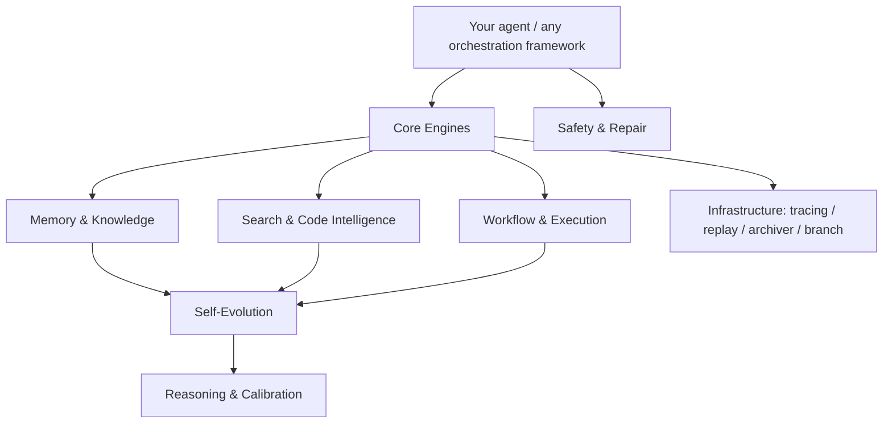

<div align="center">

# awesome-agent-infra

> **Awesome Agent Infrastructure** — 42 battle-tested, zero-dependency TypeScript packages for building reliable AI agents.

[](LICENSE)
[](https://www.typescriptlang.org/)
[](https://bun.sh)
[](https://github.com/Fengrru/awesome-agent-infra/actions/workflows/ci.yml)
[](https://github.com/Fengrru/awesome-agent-infra/actions/workflows/ci.yml)
[](CONTRIBUTING.md)

**42 packages · 0 runtime dependencies · 100% line-coverage gate · strict TypeScript 5.8 · ESM-only**

</div>

## Why awesome-agent-infra?

- **Zero dependencies, zero conflicts.** Every one of the 42 packages ships with no external runtime dependencies — drop them into any agent stack without version fights or bloat.
- **One package per concern.** Memory, patching, validation, search, workflows, self-evolution — each building block is isolated, typed, and testable on its own.
- **Production-grade by default.** Every package carries tests, a 100% coverage gate, micro-benchmarks, and an explicit stability tier (stable / evolving / experimental).
- **TypeScript-native.** Written in strict TypeScript 5.8 with ESM-only output, so your IDE and compiler see exactly what your agent runs.

## Building blocks, not a framework

awesome-agent-infra is **not** an agent framework. It does not dictate how your agent loops, which model you call, or how tools are wired. Each package is an isolated primitive you adopt one at a time — alongside any framework, or with none at all.

| | **awesome-agent-infra** | **Agent frameworks** |
|---|---|---|
| Positioning | Composable building blocks | End-to-end orchestration stack |
| Runtime dependencies | **0** per package | Typically many transitive deps |
| Adoption | Cherry-pick individual packages | Usually adopts the whole stack |
| Interoperability | Works under, above, or beside any framework | Often replaces the integration layer |
| Quality contract | 100% coverage gate + strict lint + per-package stability tier | Varies by project |

If you already run an orchestration framework, these packages slot into the gaps frameworks usually leave open: reliable file patching, memory tiering, output validation, self-healing, and session replay.

## Quick Start

Install only what you need — every package is independent:

```bash
npm install @fengrru/fuzzy-patch
```

The examples below also use `@fengrru/valid8` and `@fengrru/agent-memory`.

**Fix code with fuzzy patching** — 8 strategies that survive LLM whitespace drift:

```ts
import { fuzzyFindAndReplace, canPatch } from "@fengrru/fuzzy-patch"

const source = `const config = {
  port:   3000,
  host:  "localhost",
}`

// survives spacing differences between "port:   3000" and "port: 3000"
if (canPatch(source, "port: 3000")) {
  const { newContent, strategy, matchCount } = fuzzyFindAndReplace(source, "port:   3000", "port:   8080")
  console.log(`patched via ${strategy} (${matchCount} matches):`, newContent)
}
```

**Validate LLM output** — 4-layer validation network (syntax / semantic / runtime / security):

```ts
import { createValidationNetwork } from "@fengrru/valid8"

const network = createValidationNetwork()

const code = "export function add(a: number, b: number) {\n  return a + b\n}\n"
const syntax = await network.runSyntaxValidation(code, "add.ts")
const security = await network.runSecurityValidation(code)
console.log("confidence:", network.calculateConfidence([syntax, security]).score)
```

**Give your agent memory** — 4-tier memory with the Ebbinghaus forgetting curve:

```ts
import { createMemorySystem } from "@fengrru/agent-memory"

const mem = createMemorySystem()

mem.addLongTermMemory({
  memory_id: "ltm-1",
  content: "project uses a zero-dependency policy",
  token_count: 30,
  importance: 0.9,
  access_count: 3,
  created_at: Date.now() - 86_400_000,
  last_accessed: Date.now(),
  retention_score: 0.8,
})

// token-budgeted context assembly across all tiers
const ctx = mem.assembleContext("refactor the config module")
console.log(`${ctx.l3.length} long-term memories assembled, ${ctx.totalTokens} tokens`)
```

More runnable examples live in [examples/](./examples).

## Performance

Micro-benchmarks for hot paths run in CI-adjacent local runs (single machine, Bun runtime; median over measured iterations via `bun run benchmarks/run-all.ts`):

| Hot path | Package | Throughput |
|---|---|---|
| Exact-match patch apply | `fuzzy-patch` | 6.17M ops/sec |
| Three-way merge (no conflict) | `txn-fs` | 6.22M ops/sec |
| Confidence calibration (single output) | `confidence-gate` | 6.34M ops/sec |
| Event publish (normal priority, batched) | `event-bus` | 3.36M ops/sec |
| Long-term memory upsert | `agent-memory` | 731k ops/sec |
| Symbol lookup by name | `codegraph` | 196k ops/sec |
| Cosine similarity (300-dim vectors) | `embedding` | 94.9k ops/sec |
| 20 parallel tasks (concurrency 4) | `worker` | 19.6k task-groups/sec |

Numbers are reference points, not marketing — re-run `bun run benchmarks/run-all.ts` on your own hardware any time.

## Architecture

The 42 packages are organized in layers. Higher layers build on lower ones, but every package can also be used standalone:



- **Core Engines** — fuzzy-patch, valid8, txn-fs, taskdag, state-machine, event-bus, engine-db, worker
- **Memory & Knowledge** — agent-memory, memory-engine-v2, memory-graph, embedding, project-memory, checkpoints
- **Safety & Repair** — guardrail, healix, goal-verifier, confidence-gate
- **Self-Evolution** — skillforge, skill-curator, dreamdistill, learning-nudge, agent-metacog, process-reward

## How to choose a package

| I want to… | Start with |
|---|---|
| Apply reliable edits to files | `fuzzy-patch`, `txn-fs`, `codegraph` |
| Validate / verify agent output | `valid8`, `confidence-gate`, `goal-verifier` |
| Give my agent memory | `agent-memory`, `memory-graph`, `memory-engine-v2`, `embedding`, `project-memory` |
| Keep the agent safe | `guardrail`, `healix`, `hallucination-detector` |
| Orchestrate multi-step work | `taskdag`, `state-machine`, `dynamic-workflow` |
| Search and reason | `agentic-search`, `reasoning-search`, `code-sandbox` |
| Observe and replay sessions | `tracing`, `replay`, `archiver`, `event-bus` |
| Let the agent improve itself | `skillforge`, `skill-curator`, `dreamdistill`, `learning-nudge` |

See [choosing-packages guide](https://fengrru.github.io/awesome-agent-infra/guide/choosing-packages) for the full decision flow.

## Packages

### Core Engines

| Package | Description | npm |
|---------|-------------|-----|
| [fuzzy-patch](./packages/fuzzy-patch) | 8-strategy fuzzy file patching for AI agents | `@fengrru/fuzzy-patch` |
| [valid8](./packages/valid8) | 4-layer output validation (syntax/semantic/runtime/security) | `@fengrru/valid8` |
| [engine-db](./packages/engine-db) | Pluggable SQLite engine with 13 tables | `@fengrru/engine-db` |
| [txn-fs](./packages/txn-fs) | Transactional filesystem with 3-way merge | `@fengrru/txn-fs` |
| [taskdag](./packages/taskdag) | DAG execution engine with incremental replanning | `@fengrru/taskdag` |
| [state-machine](./packages/state-machine) | 15-state typed FSM for agent sessions | `@fengrru/state-machine` |
| [event-bus](./packages/event-bus) | Priority event bus with batch persistence | `@fengrru/event-bus` |
| [worker](./packages/worker) | Stateless worker pool with concurrency control | `@fengrru/worker` |

### Memory & Knowledge

| Package | Description | npm |
|---------|-------------|-----|
| [agent-memory](./packages/agent-memory) | 4-tier memory with Ebbinghaus forgetting curve | `@fengrru/agent-memory` |
| [memory-graph](./packages/memory-graph) | Causal dependency graph with CoW versioning + BFS cascade invalidation | `@fengrru/memory-graph` |
| [project-memory](./packages/project-memory) | File-based MEMORY.md project knowledge | `@fengrru/project-memory` |
| [agent-checkpoint](./packages/agent-checkpoint) | 3-level checkpoint system (L1/L2/L3) | `@fengrru/agent-checkpoint` |
| [checkpoint-writer](./packages/checkpoint-writer) | LLM-driven 11-field state extraction | `@fengrru/checkpoint-writer` |
| [notes-manager](./packages/notes-manager) | Session scratchpad (notes.md) for MiMo Code | `@fengrru/notes-manager` |
| [embedding](./packages/embedding) | TF-IDF vector indexing + 3-signal hybrid search | `@fengrru/embedding` |

### Safety & Repair

| Package | Description | npm |
|---------|-------------|-----|
| [guardrail](./packages/guardrail) | Runtime safety guard with risk classification | `@fengrru/guardrail` |
| [healix](./packages/healix) | Self-healing error classifier with Hamming distance matching | `@fengrru/healix` |
| [goal-verifier](./packages/goal-verifier) | Independent goal completion verification | `@fengrru/goal-verifier` |
| [confidence-gate](./packages/confidence-gate) | LLM output confidence calibration | `@fengrru/confidence-gate` |

### Search & Code Intelligence

| Package | Description | npm |
|---------|-------------|-----|
| [codegraph](./packages/codegraph) | In-memory code graph with PageRank centrality | `@fengrru/codegraph` |
| [agentic-search](./packages/agentic-search) | 4-layer intent-driven search orchestrator | `@fengrru/agentic-search` |
| [reasoning-search](./packages/reasoning-search) | MCTS tree search reasoning engine | `@fengrru/reasoning-search` |

### Workflow & Execution

| Package | Description | npm |
|---------|-------------|-----|
| [dynamic-workflow](./packages/dynamic-workflow) | VM-sandboxed workflow engine | `@fengrru/dynamic-workflow` |
| [llm-dag-generator](./packages/llm-dag-generator) | LLM-driven task DAG generation | `@fengrru/llm-dag-generator` |
| [lifecycle-manager](./packages/lifecycle-manager) | Declarative module lifecycle manager | `@fengrru/lifecycle-manager` |

### Self-Evolution

| Package | Description | npm |
|---------|-------------|-----|
| [dreamdistill](./packages/dreamdistill) | 7-day Dream + 30-day Distill self-improvement cycles | `@fengrru/dreamdistill` |
| [learning-nudge](./packages/learning-nudge) | Self-reflection trigger for continuous learning | `@fengrru/learning-nudge` |
| [max-mode-sampler](./packages/max-mode-sampler) | Best-of-N parallel plan sampling | `@fengrru/max-mode-sampler` |
| [skillforge](./packages/skillforge) | Agent-writeable skill creation and management | `@fengrru/skillforge` |
| [skill-curator](./packages/skill-curator) | Automated skill library curation | `@fengrru/skill-curator` |
| [agent-metacog](./packages/agent-metacog) | Metacognitive monitoring with knowledge boundary detection | `@fengrru/agent-metacog` |
| [process-reward](./packages/process-reward) | Process Reward Model (PRM) — MC rollout, heuristic scoring, step labeling, training | `@fengrru/process-reward` |

### Infrastructure

| Package | Description | npm |
|---------|-------------|-----|
| [cycle-controller](./packages/cycle-controller) | Context window cycle manager (MiMo Code) | `@fengrru/cycle-controller` |
| [tracing](./packages/tracing) | OpenTelemetry tracing abstraction (no-op fallback) | `@fengrru/tracing` |
| [replay](./packages/replay) | Session event replay (dry-run/read-only/full) | `@fengrru/replay` |
| [branch](./packages/branch) | Session forking and branching manager | `@fengrru/branch` |
| [archiver](./packages/archiver) | Event archiver with hot/cold tiering + gzip | `@fengrru/archiver` |

### Reasoning & Calibration

| Package | Description | npm |
|---------|-------------|-----|
| [pomdp-planner](./packages/pomdp-planner) | POMDP LLM planner (particle filter + QMDP + iterative rollout) | `@fengrru/pomdp-planner` |
| [hallucination-detector](./packages/hallucination-detector) | Spectral clustering hallucination detection + self-consistency | `@fengrru/hallucination-detector` |
| [code-sandbox](./packages/code-sandbox) | Secure code execution sandbox with VerifierPool | `@fengrru/code-sandbox` |
| [memory-engine-v2](./packages/memory-engine-v2) | 5-layer memory engine with sleep consolidation + attention retrieval | `@fengrru/memory-engine-v2` |

## Documentation

- **Docs site** — [fengrru.github.io/awesome-agent-infra](https://fengrru.github.io/awesome-agent-infra/) — quickstart, architecture overview, package selection guide, stability policy
- **Examples** — [examples/](./examples) — runnable usage snippets for 12 core packages (`bun run examples/fuzzy-patch.ts`)
- **Benchmarks** — [benchmarks/](./benchmarks) — micro-benchmarks for hot paths (`bun run benchmarks/run-all.ts`)
- **Stability matrix** — [STABILITY.md](./STABILITY.md) — per-package tier and versioning policy

## Stability

Every package carries an explicit stability tier — see [STABILITY.md](STABILITY.md) for the full matrix and versioning policy.

| Tier | Guarantee | Packages |
|---|---|---|
| Stable | Strict semver; breaking changes only in majors | txn-fs, event-bus, state-machine, engine-db, embedding, fuzzy-patch, valid8, tracing, archiver, worker |
| Evolving | API stable in practice; minor versions may adjust details | agent-memory, memory-graph, memory-engine-v2, codegraph, code-sandbox, taskdag, reasoning-search, goal-verifier, healix, replay, notes-manager, project-memory, branch, lifecycle-manager, agentic-search |
| Experimental | No guarantees; minor versions may break | dreamdistill, process-reward, agent-metacog, hallucination-detector, confidence-gate, pomdp-planner, guardrail, max-mode-sampler, cycle-controller, agent-checkpoint, checkpoint-writer, llm-dag-generator, dynamic-workflow, skillforge, skill-curator, learning-nudge |

Experimental packages are marked with an **Experimental** notice in their README. All packages follow [Changesets](https://github.com/changesets/changesets) for versioning.

## Development

```bash
bun install                          # Install all dependencies
bun run build                        # Build all packages (42 packages)
bun run test                         # Run all tests
bun run lint                         # Biome strict lint
bun scripts/check-coverage.ts        # Coverage gate (100% per package)
bun run benchmarks/run-all.ts        # Micro-benchmarks
```

## Contributing

All contributions are welcome — code, tests, docs, and issue triage. Please read [CONTRIBUTING.md](./CONTRIBUTING.md) and check the [issue templates](./.github/ISSUE_TEMPLATE/) before opening a PR.

## Security

Report security issues privately — see [SECURITY.md](./SECURITY.md) for the disclosure policy.

## License

MIT — see [LICENSE](./LICENSE).
